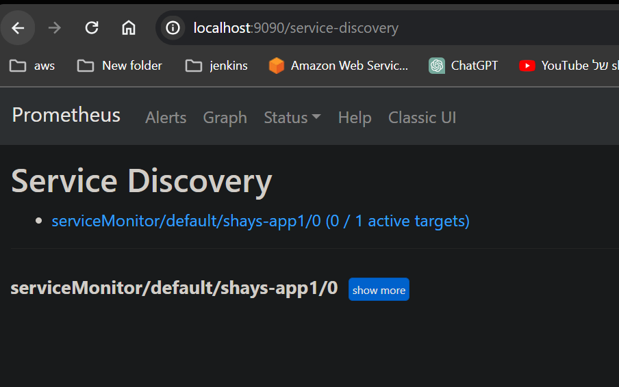

After running the script that creates the folder with the files
Enter the folder on the command line and run
skaffold dev

to deploy prometheus & grfana 
if the installation file did not worked as expected then 
go to the prometheus stuck kub-1.28 folder and follow the RM file

prometheus:

grfana:

kube get all:

deployment:

secode deployment:

prometheus service monitor:
